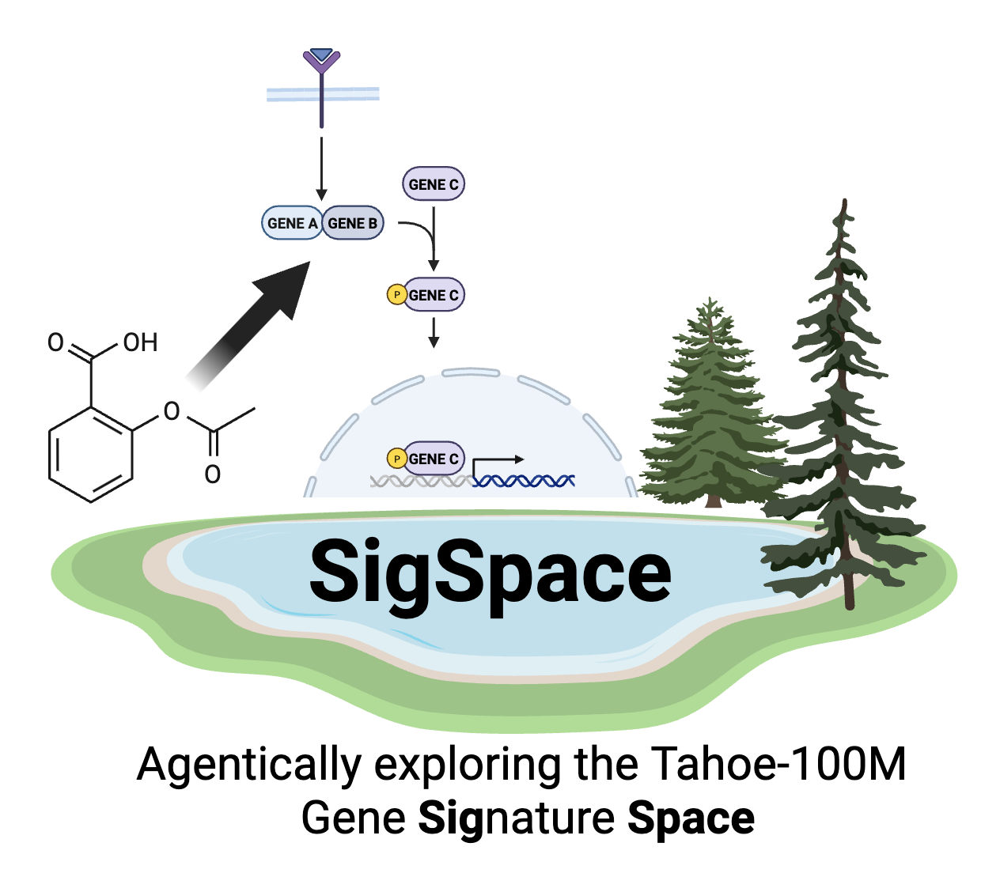

  

# SigSpace: An AI Agent for the Tahoe-100M dataset
This is a submission for the **Tahoe-DeepDive Hackathon 2025**.

# Team Name
SigSpace

## Members
- Ishita Mangla
- Kuan Pang
- Giovanni Palla
- Yanay Rosen
- Sid Sanghi
- Yasha Ektefaie
- Rohit Khurana

# Project
## SigSpace: An AI Agent for the Tahoe-100M dataset

## Overview
We have developed an AI agent that accesses the Tahoe-100M dataset along with publicly available and novel datasets. This agent works to refine and expand the mechanisms of action (MOA) and drug signatures of the perturbations within the Tahoe-100M dataset.

## Motivation
Drug discovery in the age of Large Language Models (LLMs) can be enhanced through agentic workflows that parse diverse sources of unstructured information to synthesize and connect hypotheses across different fields and modalities. However, these models are primarily trained on text data and lack the capacity to effectively interrogate rich biological databases with complex, biologically-motivated queries. In this work, we provide a proof of concept demonstrating how the Tahoe-100M dataset can be integrated with publicly available relevant datasets to expand the hypothesis space for mechanisms of action and drug responses in the perturbations tested in the Tahoe-100M dataset.

## Methods
We have curated new datasets that enhance the description of drugs and cell-lines present in the Tahoe-100M dataset. 

Specifically:
- PRISM: <briefly describe the database and what kind of information the agent is able to parse from it>
- NCI60: <briefly describe the database and what kind of information the agent is able to parse from it>
- JUMP: <briefly describe the database and what kind of information the agent is able to parse from it>
- UCE-CXG-EMBEDDING: natural perturbation search using AI virtual cell <briefly describe the database and what kind of information the agent is able to parse from it>
- ACHILLES: gene essentiality <briefly describe the database and what kind of information the agent is able to parse from it>
- TAHOE-100M: vision scores and metadata <briefly describe the database and what kind of information the agent is able to parse from it>

## Results

We have developed a Gradio application that accesses these databases and performs complex queries, enhancing and grounding the reasoning in real biological measurements.

## Discussion
